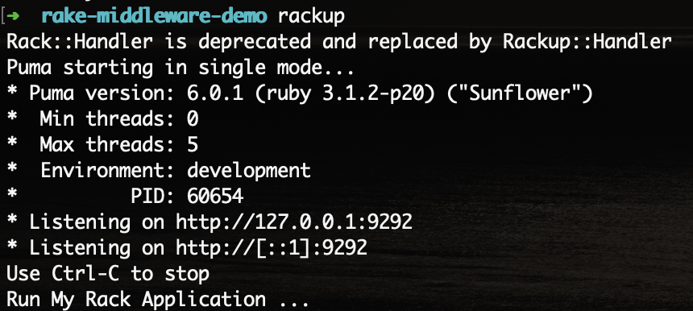
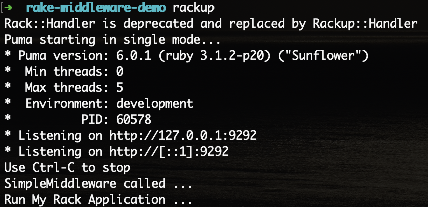

# Description

Simple Rack Application to demonstrate Rack middleware.

1. Rack application display text "Hello"
2. Using Rack middleware SimpleMiddleware
3. SimpleMiddleware only print text in console

| Not using midddleware | Using Middleware |
| --------------------- | ---------------- |
| |  |

# Usage

$ bundle install

$ rakcup

Check http://localhost:9292
